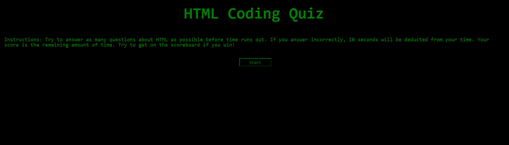
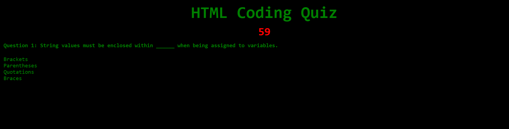
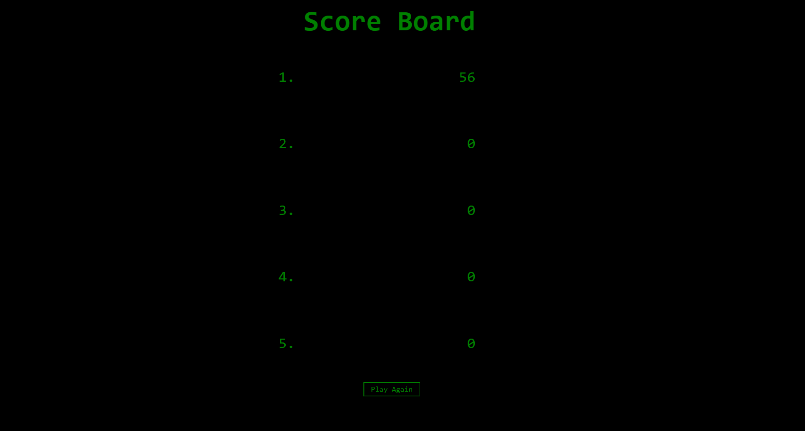

# Chapter04-WebAPIs-CodingQuiz

## Table of Contents

<br>

[Description](#description)

[Usage](#Usage)

[Criteria](#criteria)

<br>

## Description

<br>

This project is a game that quizes the user on basic javascript concepts. When the game begins, it will display 5 questions, each showing up one at a time. The user has to finish the quiz within 60 seconds. If the user selects the incorrect answer, 10 seconds are deducted from the timer. If the user runs out of time, they lose. The remaining time after completing the quiz is their score, which goes on a leaderboard on another page.

To work on this project, I had to really dive into Web API. Figuring out how to display the answer choices, only having one of them be correct, and clearing them out was tough for me to figure out. This project was excellent practice to hone my Web API skills. Unforunately, I did not have the time to make the leaderboard fully functional. At the moment, it only displays your previous score indstead of all of your scores. I also didn't get to include the ability to save initials. Despite not being able to include everything I wanted to, I am still happy with how the project turned out.


<br>
<br>


## Usage
<br>
To access the quiz, go to https://ngkent75.github.io/Chapter04-WebAPIs-CodingQuiz/
<br>


<br>
Click on start and answer the questions before the time runs out.
<br>


<br>
If you run out of time, you can click on the button to retry.
<br>


<br>
After winning, you can submit your score to the score board.
<br>


<br>


<br>

## Criteria

<br>

```
GIVEN I am taking a code quiz
WHEN I click the start button
THEN a timer starts and I am presented with a question
WHEN I answer a question
THEN I am presented with another question
WHEN I answer a question incorrectly
THEN time is subtracted from the clock
WHEN all questions are answered or the timer reaches 0
THEN the game is over
WHEN the game is over
THEN I can save my initials and my score